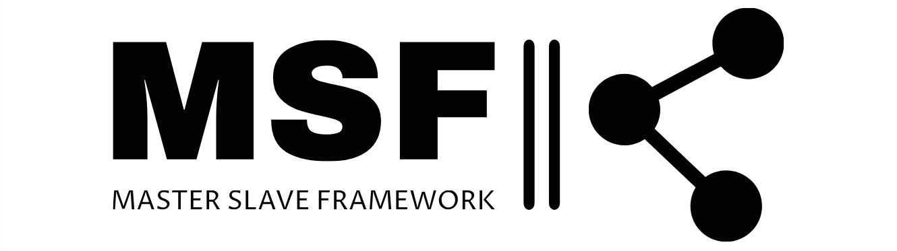

<div align="center">


</div>
<div class='parent' align="center">
<div style="display: inline-block">

![OS badge](https://img.shields.io/badge/OS-Windows-blue.svg?logo=data:image/svg%2bxml;base64,PHN2ZyBoZWlnaHQ9IjIwMHB4IiB3aWR0aD0iMjAwcHgiIHZlcnNpb249IjEuMSIgaWQ9IkxheWVyXzEiIHhtbG5zPSJodHRwOi8vd3d3LnczLm9yZy8yMDAwL3N2ZyIgeG1sbnM6eGxpbms9Imh0dHA6Ly93d3cudzMub3JnLzE5OTkveGxpbmsiIHZpZXdCb3g9IjAgMCA1MTIgNTEyIiB4bWw6c3BhY2U9InByZXNlcnZlIiBmaWxsPSIjMDAwMDAwIj48ZyBpZD0iU1ZHUmVwb19iZ0NhcnJpZXIiIHN0cm9rZS13aWR0aD0iMCI+PC9nPjxnIGlkPSJTVkdSZXBvX3RyYWNlckNhcnJpZXIiIHN0cm9rZS1saW5lY2FwPSJyb3VuZCIgc3Ryb2tlLWxpbmVqb2luPSJyb3VuZCI+PC9nPjxnIGlkPSJTVkdSZXBvX2ljb25DYXJyaWVyIj4gPHBvbHlnb24gc3R5bGU9ImZpbGw6IzkwQzMwMDsiIHBvaW50cz0iMjQyLjUyNiw0MC40MjEgNTEyLDAgNTEyLDIzOS44MzIgMjQyLjUyNiwyMzkuODMyICI+PC9wb2x5Z29uPiA8cG9seWdvbiBzdHlsZT0iZmlsbDojRjg2NzJDOyIgcG9pbnRzPSIwLDc1LjQ1MyAyMDYuNTk2LDQ0LjkxMiAyMDYuNTk2LDI0Mi41MjYgMCwyNDIuNTI2ICI+PC9wb2x5Z29uPiA8cG9seWdvbiBzdHlsZT0iZmlsbDojRkZDNDAwOyIgcG9pbnRzPSIyNDIuNTI2LDQ3MS41NzkgNTEyLDUxMiA1MTIsMjc4LjQ1NiAyNDIuNTI2LDI3OC40NTYgIj48L3BvbHlnb24+IDxwb2x5Z29uIHN0eWxlPSJmaWxsOiMwMEI0RjI7IiBwb2ludHM9IjAsNDM2LjU0NyAyMDYuNTk2LDQ2Ny4wODggMjA2LjU5NiwyNzguNDU2IDAsMjc4LjQ1NiAiPjwvcG9seWdvbj4gPC9nPjwvc3ZnPg==)
</div>
<div style="display: inline-block">

![C++ badge](https://img.shields.io/badge/Language-C++-white.svg?logo=data:image/svg%2bxml;base64,PHN2ZyByb2xlPSJpbWciIHZpZXdCb3g9IjAgMCAyNCAyNCIgeG1sbnM9Imh0dHA6Ly93d3cudzMub3JnLzIwMDAvc3ZnIj48dGl0bGU+QysrPC90aXRsZT48cGF0aCBkPSJNMjIuMzk0IDZjLS4xNjctLjI5LS4zOTgtLjU0My0uNjUyLS42OUwxMi45MjYuMjJjLS41MDktLjI5NC0xLjM0LS4yOTQtMS44NDggMEwyLjI2IDUuMzFjLS41MDguMjkzLS45MjMgMS4wMTMtLjkyMyAxLjZ2MTAuMThjMCAuMjk0LjEwNC42Mi4yNzEuOTEuMTY3LjI5LjM5OC41NDMuNjUyLjY5bDguODE2IDUuMDljLjUwOC4yOTMgMS4zNC4yOTMgMS44NDggMGw4LjgxNi01LjA5Yy4yNTQtLjE0Ny40ODUtLjQuNjUyLS42OS4xNjctLjI5LjI3LS42MTYuMjctLjkxVjYuOTFjLjAwMy0uMjk0LS4xLS42Mi0uMjY4LS45MXpNMTIgMTkuMTFjLTMuOTIgMC03LjEwOS0zLjE5LTcuMTA5LTcuMTEgMC0zLjkyIDMuMTktNy4xMSA3LjExLTcuMTFhNy4xMzMgNy4xMzMgMCAwMTYuMTU2IDMuNTUzbC0zLjA3NiAxLjc4YTMuNTY3IDMuNTY3IDAgMDAtMy4wOC0xLjc4QTMuNTYgMy41NiAwIDAwOC40NDQgMTIgMy41NiAzLjU2IDAgMDAxMiAxNS41NTVhMy41NyAzLjU3IDAgMDAzLjA4LTEuNzc4bDMuMDc4IDEuNzhBNy4xMzUgNy4xMzUgMCAwMTEyIDE5LjExem03LjExLTYuNzE1aC0uNzl2Ljc5aC0uNzl2LS43OWgtLjc5di0uNzloLjc5di0uNzloLjc5di43OWguNzl6bTIuOTYyIDBoLS43OXYuNzloLS43OXYtLjc5aC0uNzl2LS43OWguNzl2LS43OWguNzl2Ljc5aC43OXoiLz48L3N2Zz4=)
</div>
<div style="display: inline-block">

[](https://opensource.org/licenses/)
</div>
</div>

## Overview

The MasterSlaveFramework demonstrates a basic setup for a Master-Slave architecture where a master node distributes tasks to multiple slave nodes for parallel processing. \
This framework is designed for educational purposes for better understanding Master-Slave architecture and socket communication.

## Features

- **Master Node**: Responsible for task distribution, coordination and connection storage.
- **Slave Node(s)**: Execute tasks assigned by the Master Node.
- **Task Queue**: Tasks are placed in a queue and processed by target slave nodes.
- **Task Delegation**: Allows the master node to assign tasks to a slave node for execution.
- **Easy Task Implementation**: With a few lines of code, a new task can be easily added.
- **Simple Communication Protocol**: Uses Winsocket communication for inter-node communication.


## Getting started
### Dependencies

* [Windows 10 SDK](https://developer.microsoft.com/en-us/windows/downloads/windows-sdk/)
* [Visual Studio 2022](https://visualstudio.microsoft.com/vs/whatsnew/)

### Clone Repository
```
git clone https://github.com/0xMegaByte/MasterSlaveFramework.git
cd MasterSlaveFramework
```
### Build
The solution was originally built with:
- Visual Studio 2022 
- Toolset v143 
- Windows 10 SDK


## Tasks
In MSF (MasterSlaveFramework), tasks' functionalities are implemented within the slave nodes and are triggered for execution upon receipt of a ```MSFPacket``` task from the master node.

When a slave node recieves a ```MSFPacket``` task, it parses the packet and creates a new task object. \
Then pushes the newly created task to its ```TaskExecutor``` instance, which in its turn executes tasks' callbacks by their ```TaskId```.


### Create you own task (MakeABeep)
To add new task a few implementations need to take place in the Slave files and Utils library.

#### Utils Library
Under ```Communication.h``` file, add a new task id under the ```EPACKET::CMD``` namespace.\
This addition to the communication engine gives both the master and slave nodes the ability to send\/receive a task packet.
```
namespace EPACKET 
{
	namespace CMD 
    {
		constexpr int TASK_BEEP = 2000;
		constexpr int TASK_OPEN_CMD = 2001;
	}
}
```
#### Slave Files

In the ```Task.cpp``` file, create your task's callback using the ```TASK_CALLBACK_THREAD``` macro. For example:
```
TASK_CALLBACK_THREAD(MakeABeep)
{
	Beep(1000, 100);
	return 0;
}
```
Than, insert a new pair of ```<ETASK::Task::TASK_BEEP,&MakeABeep>``` to the ```TaskCallbacks``` map
```
void TaskExecutor::MakeTaskCallbacks()
{
	if (this->m_pTaskCallbacks)
	{
		TaskCallbacks& TaskCallbacks = *this->m_pTaskCallbacks;

		TaskCallbacks.insert({ ETASK::Task::TASK_BEEP, &MakeABeep});
	}
}
```

Now you can create a new MSFPacket task in the master and send it toz slave node.
```
MSFPacket* pTaskPacket = new MSFPacket(
				EPACKET::PacketType::TaskPacket,
				ulSlaveId,
				EPACKET::CMD::TASK_BEEP,
				(unsigned char*)"SomeData");
```

## Contributing

If you would like to contribute to this project, please feel free to submit a pull request. I welcome any suggestions or improvements that you may have.

## Authors

This project was created by Matan Shitrit [@0xMegaByte](https://twitter.com/0xMegaByte).

## License

This project is licensed under the [GPL-3.0](https://opensource.org/license/gpl-3-0/). See the LICENSE file for more information.